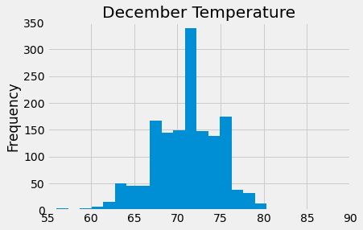

# Surfs_up Analysis

## Overview of Analysis
Thus far, W. Avy likes our analysis, but he wants more information about temperature trends before opening the surf shop. Specifically, he wants temperature data for the months of June and December in Oahu, in order to determine if the surf and ice cream shop business is sustainable year-round. In this report, we will present our weather analysis to show temperature trends during summer and winter months.

## Results

From annual temperature and precipitation data, results are extracted for the months of June and December

## Temperature Statistics and Analysis

- June average temperature: 74.9°F / December average temp: 71.0°F
- June (75th percentile): 77°F / December (75th percentile): 74°F
- 75 percent of the time the temperature is in the mid to upper 70's, regardless of whether it is June or December.
- Similar averages indicate the temperatures in Oahu stay relatively steady in the 70's year round

- Maximum temperature for both month of December and June is between 70-75 degrees.
- June low temperature: 64.0°F / December low temp: 56.0°F
- Even June's low temperatures provide good surfing and ice cream weather, whereas December's lows could present fewer opportunities for surfing and ice cream.

## Precipitation Statistics and Analysis

- The average percipitation in June is 0.136 inches per day
- The average percipitation in December is 0.217 inches per day
- 50 percent of days in June have less than 0.02 inches of percipitation and 75% have less than 0.12 inches of percipitation
- 50 percent of days in December have less than 0.03 inches of percipitation and 75% have less than 0.15 inches of percipitation
- The maximum percipitation in June is 4.43 inches on a single day
- The maximum percipitation in December is 6.42 inches on a single day

There are marginal seasonal differences in rainfall between the months of June and December.
Third quartile statistics for both months show similarity of .12 and .15 inches.
In summary, for the 2 months of June and December most rainfall amount are similar, but on extreme days there are notable differences in the amount of rain as well with December months seeing more rain than June months.

## Summary

By looking at these results, opening a surf shop seems like a smart investment. The average temperature in two extreme months of the year (June and December) seem quite similar. For most months of the year, the temperature will be good for surfing, and for having a surf shop.

## Limitation of Data and Recommendations

Additional analysis could help solidify the business case. Possible queries include:

- Query to view relationship of temperatures to precipitation during June and December.
- Query to view average temperatures and precipitation levels at different parts of Hawaii or Oahu. This could narrow down the optimal location for the shop.
- Examine all the months and outliers in precipitation, as these can indicate severe weather events.

## Assumptions

- The data is trusted as is, and is assumed to be accurate.
- Time of day when rain occurs is not available, only daily rain totals.
